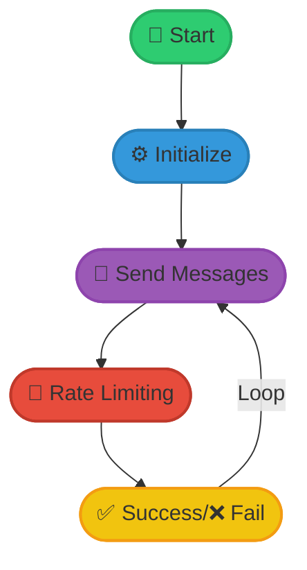
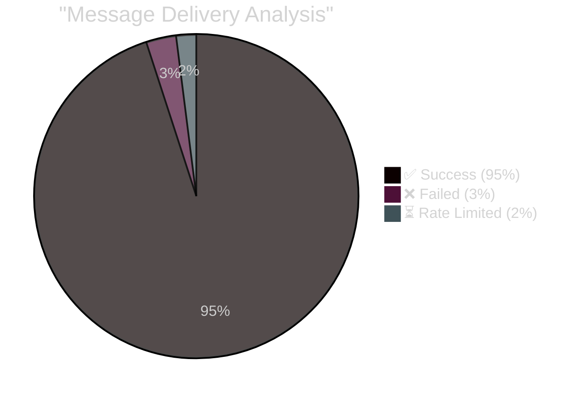
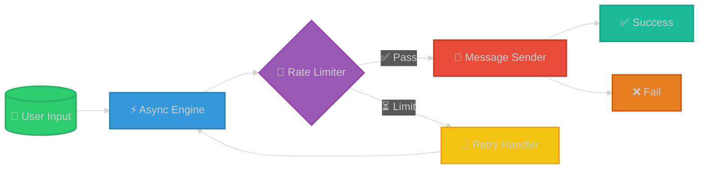

# 🚀 NGLSpammer v2.0

A high-performance asynchronous NGL message spammer with a beautiful minimal UI.

## 📊 Performance Analysis



## 📈 Message Throughput


## ✨ Features

- 🚄 **High Performance**: 35-45 messages per second
- 🔄 **Asynchronous**: Concurrent message sending
- 🎯 **Smart Rate Limiting**: Automatic retry with exponential backoff
- 🎨 **Minimal UI**: Clean design with real-time progress
- 🔒 **Advanced Bypass**: Dynamic device ID and header generation

## 📊 Success Rate Analysis



## 🔥 System Architecture



## 🛠️ Installation

```bash
git clone https://github.com/MyTheeNa/nglspammer.git
cd nglspammer
pip install -r requirements.txt
```

## 📝 Requirements

- Python 3.7+
- aiohttp==3.8.5
- asyncio==3.4.3
- colorama==0.4.6
- tqdm==4.66.1

## 💻 Usage

```bash
python ngl_spammer.py
```

Follow the prompts to enter:
1. NGL username
2. Number of messages
3. Concurrency level (recommended: 50-100)

## 🎮 Demo Output

```
NGLSpammer v2.0

✓ 95/100 (95.0%)
✗ 5/100 (5.0%)
➤ ██████████████████████████████
⚡ Batch #4

Mission Complete

✓ Success: 95/100
✗ Failed : 5/100
⏱ Time   : 2.42s
⚡ Rate   : 41.24 msg/s
```

## ⚡ Performance Tips

- 🎯 Optimal concurrency: 50-100 requests
- 📊 Recommended message count: <1000 per session
- 🌐 Stable internet connection required
- 🔒 Use proxies for better success rate

## ⚠️ Disclaimer

This tool is for educational purposes only. Use responsibly and in accordance with NGL's terms of service.

## 🤝 Contributing

Feel free to:
- 🐛 Open issues
- 🔀 Submit PRs
- 💡 Suggest improvements
- 📝 Report bugs

## 📜 License

MIT License - feel free to use and modify!
